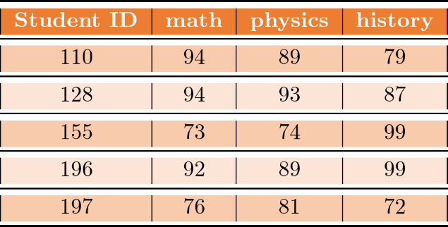
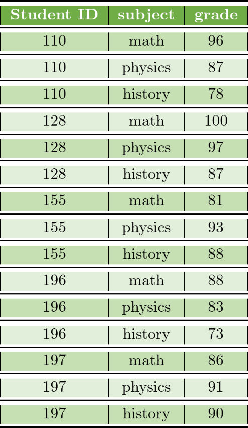

{width="400"}

# Introduction

In this project our task is use some practice data sets to improve our ability in manipulating different formats. In particular our mission is to

1.  Select three "wide" datasets. For every one of the three selected datasets:

    -   Create a.CSV file (or, optionally, a MySQL database!) containing all of the dataset's information.

    -   Import the contents of your.CSV file into R, and use tidyr and dplyr to clean and transform your data as necessary.

    -   Conduct the analysis outlined in the discussion item.

2.  For each of the three datasets submit:

    -   The URL to the.Rmd file in your GitHub repository
    -   The URL to your rpubs.com web page.

We start with a brief description of wide and long data

## Wide and Long Datasets

In wide data formats each variable is a column and each participant a row. As a result, wide format contains values that do not repeat in the first column.

In long format, each participant has multiple rows in dataset. Hence, a long format has values that do repeat in the first column.

Suppose we want a dataset which includes the final grades of students in 3 subject. The wide and long formats are shown below.

{width="400"}

{width="350"}

## Datasets

We consider the following three datasets

-   California Housing Prices
-   Airbnb Dataset
-   Air Quality

# California Housing Prices

-   This is a publicly available dataset that contains information about housing prices and other factors in California. The dataset was created in 1997 by Pace, R. Kelley and Ronald Barry, and is based on the 1990 California census data. The dataset contains 20,640 samples and 8 features, including:

    -   Median income

    -   Housing median age

    -   Total rooms

    -   Total bedrooms

    -   Population

    -   Households

    -   Latitude

    -   Longitude

    -   Median house value

We start by loading the required libraries

```{r echo=TRUE, warning=FALSE}
# Library Imports
library(dplyr)
library(tidyr)
library(stringr)
library(knitr)
library(ggplot2)
library(zoo)
library(plotly)
library(gridExtra)
library(grid)
library(GGally)
```

Next we read the .CSV file into a dataframe and display the top rows

```{r echo=TRUE, warning=FALSE}
CA <- read.csv("housing.csv")
head(CA)
```

All the attributes are numerical.

## Cleaning the Data

First we would like to see which attributes have missing or non-numerical values.

```{r}
names(CA)[which(colSums(is.na(CA)) > 0)]
```

The total bed_bedrooms is the only column with missing value. We can use the column mean to fill the missing values, but since the number of bedrooms is an integer, median is a better choice.

```{r}
# Fill missing values with median of column
CA_filled <- CA %>% mutate_all(list(~ifelse(is.na(.), median(., na.rm = TRUE), .)))
```

## Analysis

We start by looking at the summary statistics of the data

```{r}
summary(CA_filled)
```

To get an idea about the distribution of the data, we can also look at the histograms

```{r message=FALSE, warning=FALSE}
plots <- lapply(names(CA_filled), function(x) ggplot(CA_filled, aes(x = .data[[x]], fill = x)) + 
    geom_histogram(alpha = 0.5, position = "identity", color = "black") + 
    scale_fill_discrete(name = NULL, guide = FALSE))

# Create a 3 by 3 grid of plots
grid.arrange(grobs = plots, ncol = 3)
```

When given a multivariate dataset, one can get great insight by looking at the covariance matrix. For this purpose, we will ignore the first two columns

```{r message=FALSE, warning=FALSE, paged.print=FALSE}
# Select the last 7 columns of the dataframe
CA_filled_subset <- CA_filled[, 3:9]


# Generate the scatter matrix with blue color
ggpairs(CA_filled_subset, 
      lower = list(continuous = wrap("points", alpha = 0.5, color = "blue")),
      diag = list(continuous = wrap("densityDiag", fill = "blue", alpha = 0.5))) +
  theme(panel.background = element_rect(fill = "white", colour = "white"),
      panel.grid.major = element_line(colour = "gray", linetype = "dashed"),
      panel.grid.minor = element_blank(),
      axis.line = element_line(colour = "black"),
      text = element_text(size = 7)) 

# Save the plot as png
ggsave("scatter_matrix.png", width = 7, height = 7, dpi = 150)
```

## Data Transformation

In general it is always a good idea to normalize our data. There are several ways to do this. Suppose our data is $x_1,x_2,\cdots, x_n$ with sample mean

$$
\hat{\mu}=\frac{1}{n}\sum_{i=1}^nx_i
$$ and sample variance

$$
\hat{\sigma}^2=\frac{\sum_{i=1}^n(x_i-\hat{\mu})^2}{n-1}
$$

One way to transform our data is

$$
Y=\frac{X-\mu}{\hat{\sigma}}
$$

This way the transformed data will have zero mean and unit variance.

Let $x_{max}=\max(x_1,x_2,\cdots,x_n)$ and $x_{min}=\min(x_1,x_2,\cdots,x_n)$ . Another transform will map our data either to $[0,1]$ or $[-1,1]$ depending on the data. Generally if the data is positive we map to $[0,1]$ and if it is positive and negative we map to $[-1,1]$.

The mapping to $[0,1]$ is given by the transform

$$
Y=\frac{X-x_{min}}{x_{max}-x_{min}}
$$

In general, we can map from $[x_{min},x_{max}]$ to any arbitrary interval $[a,b]$ using the transform

$$
Y=a+\frac{(X-x_{min})(b-a)}{x_{max}-x_{min}}
$$

Besides normalization there are other types of transformation that can be very useful. Looking at our distributions, we note that population and house holds have very skewed distributions. In general we would like our variable to have normal distributions. There are several statistical methods to make a distribution more normal. Probably the simplest one is the log transform.

$$
Y=\ln X
$$

This transform is not always ideal especially if we have negative values, however in our case this is not the case.

```{r}
CA_filled$log_population <- log(CA_filled$population)
CA_filled$log_households <- log(CA_filled$households)

# Create a list of ggplot objects for each column with original and log-transformed histograms

plots <- lapply(c("population", "log_population", "households", "log_households"), function(x) {
    ggplot(CA_filled, aes(x = .data[[x]])) + 
        geom_histogram(alpha = 0.5, position = "identity", color = "red") + 
        scale_x_continuous(name = x) +
        ggtitle(paste("Histogram of", x))
})

# Create a 2 by 2 grid of plots
grid.arrange(grobs = plots, ncol = 2)
```

As you can see the transformed variables are much more normal and symmetric.

# Airbnb Dataset

This dataset contains a total of 279713 records in three .CSV files. As the first step we will merge the files.

```{r}
# Load the csv files as dataframes
airbnb_listing_price <- read.csv("airbnb_listing_price.csv")
airbnb_location_info <- read.csv("airbnb_location_info.csv")
airbnb_property_info <- read.csv("airbnb_property_info.csv")
# Merge the dataframes based on listing_id
merged_df <- merge(airbnb_listing_price, airbnb_location_info, by = "listing_id")
merged_df <- merge(merged_df, airbnb_property_info, by = "listing_id")
# delete the seperate files to free up memory
rm(airbnb_listing_price, airbnb_location_info, airbnb_property_info)
# We only going to keep 7 columns
new_df <- merged_df %>%
    select(listing_id, price, city, name, property_type, room_type, bedrooms)
# delete the merged df
rm(merged_df)
```

To clean the data and remove the missing values, first we determine the columns with missing values

```{r}
# get the count of missing or NA values in each column
missing_count <- colSums(is.na(new_df))

# get the names of columns with missing or NA values
missing_cols <- names(missing_count[missing_count > 0])

# print the names of columns with missing or NA values
print(missing_cols)
```

So the bedrooms column contains missing values. We will fill the missing values with the median of bedrooms since we would like an integer.

```{r}
new_df <- new_df %>%
    mutate(bedrooms = ifelse(is.na(bedrooms), median(bedrooms, na.rm = TRUE), bedrooms))
```

### Analysis

For analysis our aim is to find the most and least expensive of the cities for one, two, three, and greater than three bedrooms. It might be helpful to visualize the results first.

```{r message=FALSE, warning=FALSE}
ggplot(new_df %>%
    group_by(bedrooms, city) %>%
    summarise(avg = median(price)),
    aes(x=bedrooms, y=avg, color=city)
) + 
geom_point(stat='identity')

ggsave("airbnb.png", dpi=300)
```

We start by finding the most and least expensive one bedroom rentals.

```{r message=FALSE, warning=FALSE, paged.print=FALSE}

one_bedroom_df <- new_df %>%
    filter(bedrooms == 1)
    # get the row with the highest price
highest_price_row <- one_bedroom_df %>%
        slice(which.max(price))

    # get the row with the lowest price
lowest_price_row <- one_bedroom_df %>%
        slice(which.min(price))

    # print the rows with the highest and lowest price
print(highest_price_row)
print(lowest_price_row)
```

Next, we consider two bedroom rentals.

```{r message=FALSE, warning=FALSE, paged.print=FALSE}
two_bedroom_df <- new_df %>%
    filter(bedrooms == 2)
    # get the row with the highest price
highest_price_row <- two_bedroom_df %>%
        slice(which.max(price))

    # get the row with the lowest price
lowest_price_row <- two_bedroom_df %>%
        slice(which.min(price))

    # print the rows with the highest and lowest price
print(highest_price_row)
print(lowest_price_row)
```

Finally we consider rentals with more than two rooms.

```{r message=FALSE, warning=FALSE, paged.print=FALSE}
# select all the rows with rooms more than two
more_than_two_rooms_df <- new_df %>%
    filter(bedrooms > 2)

# get the row with the highest price
highest_price_row <- more_than_two_rooms_df %>%
    slice(which.max(price))

# get the row with the lowest price
lowest_price_row <- more_than_two_rooms_df %>%
    slice(which.min(price))

# print the rows with the highest and lowest price
print(highest_price_row)
print(lowest_price_row)
```

# Air Quality

This dataset is from UC Irvine Machine Learning Repository. It contains gas multisensor device field responses from an Italian city. Certified analyzer gas concentrations and hourly response averages are recorded. The dataset includes 9358 hourly averaged answers from 5 metal oxide chemical sensors in an Air Quality Chemical Multisensor Device. The longest freely available recordings of on-field deployed air quality chemical sensor device responses were from March 2004 to February 2005. A co-located reference certified analyzer produced hourly averaged CO, Non Metanic Hydrocarbons, Benzene, Total Nitrogen Oxides (NOx), and NO2 concentrations that were ground truth. According to De Vito et al., Sens. And Act. B, Vol. 129,2,2008 (citation required), cross-sensitivities and concept and sensor drifts affect sensor concentration estimation. Missing values are -200.

The data has 15 columns which are

-   Date (dd/mm/yyyy)

-   Time (hh.mm.ss)

-   CO(GT): Hourly averaged CO concentration

-   PT08.S1(CO): Hourly averaged tin oxide

-   NMHC(GT): hourly averaged overall Non Metanic HydroCarbons concentration

-   C6H6(GT): hourly averaged Benzene concentration

-   PT08.S2(NMHC): (titania) hourly averaged sensor response

-   NOx(GT): hourly averaged NOx concentration

-   PT08.S3(NOx): (tungsten oxide) hourly averaged sensor response

-   NO2(GT): hourly averaged NO2 concentration

-   PT08.S4(NO2): (tungsten oxide) hourly averaged sensor response

-   PT08.S5(O3): (indium oxide) hourly averaged sensor response

-   T : temperature

-   RH: relative humidity

-   AH: absolute humidity

We start by reading the data into a dataframe called air_quality. Next we combine Date and Time columns into a single date_time column and subsequently drop Date and Time.

```{r message=FALSE, warning=FALSE, paged.print=FALSE}
air_quality <- read.csv("AirQualityUCI.csv")
air_quality$date_time <- paste(air_quality$Date, air_quality$Time)
air_quality <- air_quality %>%
    select(-c(Date, Time))
head(air_quality)
```

In the data description it is noted that the values -200 denote missing values. We fill the missing values with the column mean.

```{r}
# replace -200 values with column mean
air_quality <- air_quality %>%
    mutate_if(is.numeric, function(x) ifelse(x == -200, mean(x, na.rm = TRUE), x))
```

```{r fig.height=8, fig.width=9}
new_air_quality <- select(air_quality, -c(date_time, T, RH, AH))

ggcorr(new_air_quality, label = TRUE) +
    ggtitle("Correlation Matrix") +
    theme(plot.title = element_text(hjust = 0.5)) 

ggsave("corr_matrix3.png", width = 10, height = 8, dpi = 300)
```

Next, we scale our data

```{r message=FALSE, warning=FALSE}
# Load the caret package
library(caret)

# Scale the air quality dataset
scaled_air_quality <- as.data.frame(scale(air_quality[, -which(names(air_quality) == "date_time")])) 
```

As the final step we spplit our data in 85/15 split and choose Relative Humidity (RH) as the target variable and the rest as features and try to do a multivariate regression.

```{r}
# Create a data partition for the RH column
set.seed(123) # for reproducibility
trainIndex <- createDataPartition(scaled_air_quality$RH, p = .85, list = FALSE, times = 1)

train <- scaled_air_quality[trainIndex, ]
test <- scaled_air_quality[-trainIndex, ]

# Perform linear regression
model <- lm(RH ~ ., data = train)

# Print the summary of the model
summary(model)
```

And finally we test our model of test dateset.

```{r}
# predict the values of the response variable using the test set
predictions <- predict(model, newdata = test)

# calculate the performance metrics
mse <- mean((test$RH - predictions)^2)
rmse <- sqrt(mse)

# print the performance metrics
cat("MSE:", mse, "\n")
cat("RMSE:", rmse, "\n")
```
